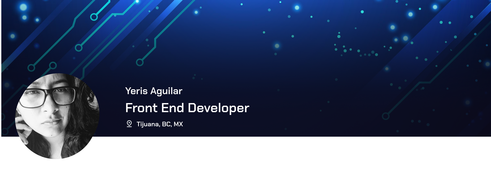

 Hello there! I'm Yeris, and I am a passionate front-end web developer with a deep love for crafting captivating digital experiences.

<h2>Tech stack</h2>

  
  
  
  
  
  
  
  
  
  
  
  
  
  

  
  ## Stats
    
  

## Take a Look to my web portfolio!

https://yalex95.github.io/portfolio/
